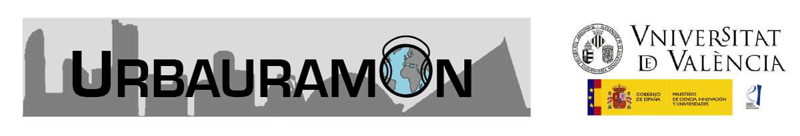

URPAA: Urbauramon Modified Psycho-acoustic Annoyance Analyzer
=============================================

### Table of Contents

**[Requirements](#requirements)**  
**[What can I do with URPAAnalyzer?](#what-can-i-do-with-urpaanalyzer)**   
**[Credits and License](#credits-and-license)**    
**[Authors](#authors)**

Requirements
------------

* **Matlab R2020b** (or later version)
* **Signal Processing Toolbox** (Mathworks)
* **DSP System Toolbox** (Mathworks)

What can I do with URPAA Rasp Analyzer?
----------------------------------

URPAAnalyzer Rasp allows to analyze the modified model of psycho-acoustic annoyance of an audio file supplied as input parameter, taking into account the Tonality metric as well as the other psycho-acoustic metrics defined by Zwicker and Fastl. 
The nuisance model is based on the Zwicker model, described in:

Zwicker E., Fastl H. ‘Psychoacoustics: Facts and Models’(1990).

and the modified version is described in:

G. Di, X. Chen, K. Song, B. Zhou, Ch. Pei, 'Improvement of Zwicker’s psychoacoustic annoyance model aiming at tonal noises', Applied Acoustics, Vol. 105, 2016, pp. 164-170,
https://www.sciencedirect.com/science/article/pii/S0003682X15003606

It should be noted that only single-channel with 1 second duration audio is accepted and that it is resampled at 16Khz before analysis.
But it is very simple to select channels using basic Matlab functions and create *.wav files  with the necessary characteristics.

The implementation has been introduced in a Simulink model, using function interface, in order to be included in a Raspberry Pi (model 3B+ o 4B+). The procedure to integrate this model is described in:

https://es.mathworks.com/help/supportpkg/raspberrypi/ug/create-and-run-an-application-on-raspberry_pi-hardware.html

Credits and License
----------------------------------

This is an extension of the source distribution of **URPAA: Urbauramon Psycho-acoustic Annoyance Analyzer** licensed
under the GPLv3+. Please consult the file COPYING for more information about this license.

Website: https://github.com/jausegar/urbauramon/new/master/URPAA_Rasp_simulink

If you have questions, bug reports or feature requests, please use the [Issue
Section on the website](https://github.com/jausegar/urbauramon/issues) to report them. 

If you use our Audio Analyzer for your publications please cite our SEA papers:

"Zwicker’s Annoyance model implementation in a WASN node"
A. Pastor-Aparicio, J. Lopez-Ballester, J. Segura-Garcia, S. Felici-Castell, M. Cobos-Serrano, R. Fayos-Jordán, J.J. Pérez-Solano.
INTERNOISE 2019, 48th International Congress and Exhibition on Noise Control Engineering

"Visualization of nuisance information in acoustic environments using an IoT system"
J. Segura-Garcia, J. Lopez-Ballester, A. Pastor-Aparicio, S. Felici-Castell, M. Cobos-Serrano, J.J. Pérez-Solano, A. Soriano-Asensi, M. Garcia-Pineda.
INTERNOISE 2019, 48th International Congress and Exhibition on Noise Control Engineering

Copyright (c) 2021-2022   
Department of Computer Science    
Universitat de València  
Av. de la Universitat s/n, 46100, Valencia, Spain.  

Authors
------------
 
* Jaume Segura-Garcia
* Jesus Lopez-Ballester
* Adolfo Pastor-Aparicio
